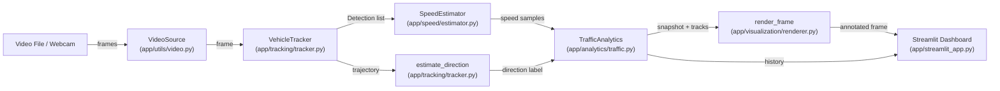

# AutoVision — Real-Time Vehicle Intelligence & Traffic Analytics

AutoVision is a computer-vision system that detects, tracks, and analyzes vehicles from video files or a live camera feed. It chains a YOLO object-detection model (via [Ultralytics](https://docs.ultralytics.com/)) with ByteTrack or BoT-SORT multi-object tracking, a calibrated pixel-to-meter speed estimator, directional analysis, line-crossing vehicle counting, and speed-violation flagging — all surfaced through an interactive Streamlit dashboard with live Plotly charts. Speed estimates are **approximate** (derived from a single pixel-to-meter calibration reference, not radar or lidar) and are intended for analytics and educational use, not law enforcement.

---

## Features

- **YOLO-based vehicle detection** — uses Ultralytics YOLOv8 (configurable model weights) filtered to vehicle classes: `car`, `motorcycle`, `bus`, `truck` (editable in config).
- **Multi-object tracking** — ByteTrack (default) or BoT-SORT, selectable via `tracker.type` in config; wraps the Ultralytics `model.track()` API.
- **Calibrated speed estimation** — pixel displacement between frames is converted to km/h through a user-supplied two-point reference distance. A sliding-window average smooths per-frame noise.
- **Speed-violation detection** — flags any tracked vehicle whose smoothed speed exceeds the configured `speed.limit_kmh`.
- **Directional analysis** — labels each vehicle's travel direction as screen-relative (`Moving Up`, `Moving Down`, `Moving Left`, `Moving Right`) or geographic (`Northbound`, `Southbound`, etc.) based on net trajectory displacement.
- **Line-crossing vehicle counting** — a configurable horizontal measurement line counts each vehicle exactly once when it crosses, broken down by vehicle type.
- **Per-vehicle trajectory rendering** — recent position history is drawn as a polyline overlay on the video frame (togglable in the sidebar).
- **Live Streamlit dashboard** — real-time metrics (active vehicles, total counted, average/max speed, violations, counts by type), a per-vehicle data table, and Plotly charts (vehicle count over time, average speed over time, speed distribution histogram, vehicles by type, violations over time).
- **Three input modes** — upload a video file (`.mp4`, `.avi`, `.mov`, `.mkv`), connect a local webcam, or a "Sample / demo" placeholder that explains where to source a Creative-Commons traffic clip.
- **Sidebar configuration** — detection confidence, IoU threshold, speed limit, measurement-line position, and calibration distance are adjustable live without restarting.
- **Environment-variable overrides** — `AUTOVISION_CONFIG` to point to a custom YAML config file; `AUTOVISION_LOG_LEVEL` to change the log level.

---

## Architecture

AutoVision is organized as a set of single-responsibility modules under `app/`, wired together by a thin Streamlit entry point (`app/streamlit_app.py`). Business logic is deliberately kept out of the UI layer so each component can be tested independently.

**Pipeline summary:**

1. `app/utils/video.py` — opens the video file or camera and yields frames.
2. `app/tracking/tracker.py` (`VehicleTracker`) — runs YOLO detection + tracking (`model.track()`) on each frame, producing `Detection` objects.
3. `app/speed/calibration.py` (`PixelToMeterCalibrator`) — derives a meters-per-pixel scale factor from two user-supplied reference points.
4. `app/speed/estimator.py` (`SpeedEstimator`) — converts pixel displacement between consecutive detections into smoothed km/h using the calibrator.
5. `app/tracking/tracker.py` (`estimate_direction`) — labels each vehicle's travel direction from its trajectory.
6. `app/analytics/traffic.py` (`TrafficAnalytics`) — counts line crossings, evaluates speed violations, and produces `TrafficSnapshot` aggregates.
7. `app/visualization/renderer.py` (`render_frame`) — composites bounding boxes, labels, trajectories, and the measurement line onto each frame.
8. `app/streamlit_app.py` — displays the annotated video stream, live metric cards, a vehicle data table, and Plotly analytics charts.



---

## Demo

The Streamlit dashboard displays:

- **Annotated video stream** — bounding boxes colored green (normal) or red (violation), labeled with track ID, vehicle class, confidence percentage, and current speed in km/h. A blue horizontal "measurement / counting line" is drawn at the configured fraction of frame height. Vehicle trajectories appear as polyline overlays.
- **Metric cards** — Total vehicles, Currently visible, Avg speed (km/h), Max speed (km/h), Violations, and By type.
- **Vehicle table** — a live `DataFrame` of every active track (ID, Type, Confidence, Current / Average / Max Speed, Direction, Time in Scene, Violation status).
- **Plotly charts** — Vehicles by type (bar), Speed distribution (histogram), Vehicle count over time (line), Average speed over time (line), Violations over time (line).

To run the dashboard, see the [Usage](#usage) section below.

> **Screenshots:** No screenshots are bundled with this repository yet. To add them, place images in `assets/` (the directory is `.gitkeep`-tracked) and reference them here, e.g. ``.

---

## Requirements

| Requirement | Version |
|---|---|
| Python | ≥ 3.11 (per `pyproject.toml` `requires-python`) |
| OS | Linux, macOS, or Windows (any platform supported by OpenCV and PyTorch) |
| GPU | Optional — `model.device: auto` in the config auto-selects CUDA when available, otherwise falls back to CPU |

Core dependencies (from `requirements.txt`):

- `ultralytics >= 8.2.0`
- `opencv-python >= 4.9.0`
- `numpy >= 1.26.0`
- `pandas >= 2.2.0`
- `streamlit >= 1.35.0`
- `plotly >= 5.22.0`
- `PyYAML >= 6.0.1`

Dev dependency: `pytest >= 8.2.0`

---

## Installation

```bash
# 1. Clone the repository
git clone https://github.com/Mzaq1559/autovision-vehicle-intelligence.git
cd autovision-vehicle-intelligence

# 2. Create and activate a virtual environment
python -m venv .venv

# macOS / Linux
source .venv/bin/activate

# Windows (PowerShell)
# .venv\Scripts\Activate.ps1

# Windows (cmd)
# .venv\Scripts\activate.bat

# 3. Install dependencies
pip install -r requirements.txt

# 4. (Optional) Install the project itself in editable mode
pip install -e .
```

On first run, Ultralytics will automatically download the `yolov8n.pt` weights (~6 MB) if they are not already present. No manual model download is required.

---

## Usage

### Starting the dashboard

```bash
streamlit run app/streamlit_app.py
```

The app opens at `http://localhost:8501` by default.

### Input modes

The sidebar offers three input modes:

1. **Video file** — upload an `.mp4`, `.avi`, `.mov`, or `.mkv` file through the Streamlit file uploader. The file is written to a temporary location and processed frame by frame. This is the recommended mode for getting started.

2. **Webcam** — select a camera index (default `0`) and click **Start webcam**. This requires a camera accessible to the machine running the Streamlit process. In hosted or containerized environments a camera is typically unavailable; in that case, use Video file mode with a short clip instead.

3. **Sample / demo** — no sample video is bundled with the repository (to avoid shipping copyrighted media). The sidebar displays instructions to download a short Creative-Commons traffic clip, place it in `assets/`, and then use the Video file uploader. Example sources:
   - [Pexels free traffic videos](https://www.pexels.com/search/videos/traffic/)
   - [Pixabay free traffic footage](https://pixabay.com/videos/search/traffic/)

### Sidebar controls

While processing, the sidebar exposes live-adjustable parameters:

- **Detection confidence** (slider, 0.05–0.95)
- **IoU threshold** (slider, 0.1–0.9)
- **Speed limit (km/h)** (numeric input)
- **Measurement / counting line** position (slider, 0.05–0.95 fraction of frame height)
- **Calibration reference distance (m)** (numeric input)
- **Show trajectories** (checkbox)

A collapsible **"About speed estimates"** panel reminds the user that speeds are approximate.

---

## Speed Estimation Method

Speed estimation is performed by `app/speed/estimator.py` (`SpeedEstimator`) using `app/speed/calibration.py` (`PixelToMeterCalibrator`).

**How it works:**

1. The operator provides two pixel coordinates and the real-world distance between them (in meters) via the `calibration` section of the config. `PixelToMeterCalibrator` divides the real-world distance by the Euclidean pixel distance to compute a single **meters-per-pixel** scale factor.
2. For each tracked vehicle, the `SpeedEstimator` computes the pixel displacement between the vehicle's foot-point (bottom-center of the bounding box) in consecutive frames, multiplies by meters-per-pixel, divides by the inter-frame time interval, and converts to km/h.
3. A sliding-window average (`speed.smoothing_window`, default 5 samples) reduces frame-to-frame jitter from detection noise. No speed is reported until `speed.min_samples_for_estimate` (default 3) samples have been collected for a given track.

**What this is _not_:**

- This is a **linear pixel-to-meter approximation**, not a full perspective transform or homography.
- It assumes the measurement zone is roughly perpendicular to the camera's viewing axis and at a similar depth to the calibration reference.
- Accuracy degrades toward frame edges, at steep camera angles, or when vehicles deviate significantly from the calibrated plane.
- It is **not a substitute for radar, lidar, or legally calibrated enforcement equipment**.

---

## Calibration

Calibration is required to convert pixel displacement into real-world speed. The process is:

1. Choose two points in the video frame whose real-world distance you can measure (e.g., lane-marking spacing, a known gap between poles).
2. Find their pixel coordinates `(x, y)` in a representative frame.
3. Enter the pixel coordinates in `calibration.reference_points_px` and the measured distance in `calibration.reference_distance_m` in `configs/default.yaml` (or a scene-specific copy).
4. Position the measurement line (`measurement_zone.line_y_fraction`) near the calibrated reference for best accuracy.

For detailed guidance, caveats, and tips for improving accuracy, see [docs/calibration.md](docs/calibration.md).

---

## Configuration

All configuration is defined in `configs/default.yaml` and loaded by `app/config/settings.py` (`load_config`). Copy the file (e.g. `configs/my_scene.yaml`) and set `AUTOVISION_CONFIG=configs/my_scene.yaml` to use a custom configuration. Every value can also be adjusted at runtime via the Streamlit sidebar.

| Key | Type | Default | Description |
|---|---|---|---|
| `model.weights` | `str` | `yolov8n.pt` | Ultralytics model name or path to local weights file |
| `model.device` | `str` | `auto` | Inference device: `auto` (selects CUDA if available, else CPU), `cpu`, or `cuda` |
| `model.confidence` | `float` | `0.35` | Minimum detection confidence threshold |
| `model.iou_threshold` | `float` | `0.45` | IoU threshold for non-maximum suppression |
| `model.classes` | `list[str]` | `[car, motorcycle, bus, truck]` | COCO class names to detect (others are filtered out) |
| `tracker.type` | `str` | `bytetrack` | Tracking algorithm: `bytetrack` or `botsort` |
| `tracker.track_buffer` | `int` | `30` | Number of frames a lost track is kept before deletion |
| `tracker.match_threshold` | `float` | `0.8` | Association matching threshold for the tracker |
| `tracker.trajectory_length` | `int` | `40` | Number of recent positions kept per vehicle for trajectory display |
| `calibration.reference_distance_m` | `float` | `20.0` | Real-world distance (meters) between the two calibration reference points |
| `calibration.reference_points_px` | `list[list[float]]` | `[[100, 600], [100, 200]]` | Pixel `[x, y]` coordinates of the two calibration points |
| `calibration.fps` | `float \| null` | `null` | Override FPS; `null` reads FPS from the video/camera source |
| `measurement_zone.line_y_fraction` | `float` | `0.6` | Position of the measurement/counting line as a fraction (0–1) of frame height |
| `measurement_zone.line_thickness_px` | `int` | `4` | Thickness of the measurement line overlay in pixels |
| `speed.limit_kmh` | `float` | `60.0` | Speed limit (km/h) above which a violation is flagged |
| `speed.smoothing_window` | `int` | `5` | Number of recent speed samples averaged for each vehicle |
| `speed.min_samples_for_estimate` | `int` | `3` | Minimum samples before a speed is reported for a track |
| `direction.mode` | `str` | `screen_relative` | Direction label style: `screen_relative` or `geographic` |
| `direction.min_displacement_px` | `float` | `6.0` | Minimum net pixel displacement before a direction is assigned (below = "Stationary") |
| `direction.geographic_labels` | `dict` | `{up: Northbound, ...}` | Mapping from screen-space bearing to geographic label (used when `mode: geographic`) |
| `counting.line_y_fraction` | `float` | `0.6` | Counting-line position (mirrors `measurement_zone.line_y_fraction`) |
| `counting.line_thickness_px` | `int` | `4` | Counting-line rendering thickness |
| `video.default_fps` | `float` | `30.0` | Fallback FPS when the video source does not report one |
| `video.max_width` | `int` | `1280` | Maximum frame width in pixels; larger frames are downscaled preserving aspect ratio |
| `log_level` | `str` | `INFO` | Logging level (`DEBUG`, `INFO`, `WARNING`, `ERROR`); also overridable via `AUTOVISION_LOG_LEVEL` env var |

---

## Project Structure

```
autovision-vehicle-intelligence/
├── app/
│   ├── __init__.py                  # Package marker, exports __version__
│   ├── streamlit_app.py             # Streamlit dashboard entry point
│   ├── analytics/
│   │   ├── __init__.py
│   │   └── traffic.py               # TrafficAnalytics, TrafficSnapshot, counting, violations
│   ├── config/
│   │   ├── __init__.py
│   │   └── settings.py              # AppConfig dataclasses, YAML loader
│   ├── detection/
│   │   ├── __init__.py
│   │   └── detector.py              # VehicleDetector (standalone YOLO predict, no tracking)
│   ├── models/
│   │   ├── __init__.py
│   │   └── vehicle.py               # Detection and VehicleTrack dataclasses
│   ├── speed/
│   │   ├── __init__.py
│   │   ├── calibration.py           # PixelToMeterCalibrator, InvalidCalibrationError
│   │   └── estimator.py             # SpeedEstimator, instantaneous_speed_kmh, is_speed_violation
│   ├── tracking/
│   │   ├── __init__.py
│   │   └── tracker.py               # VehicleTracker (YOLO track), estimate_direction
│   ├── utils/
│   │   ├── __init__.py
│   │   └── video.py                 # VideoSource, VideoSourceError, resize_keep_aspect
│   └── visualization/
│       ├── __init__.py
│       └── renderer.py              # draw_detections, draw_trajectories, render_frame
├── assets/
│   └── .gitkeep                     # Placeholder — put sample videos or screenshots here
├── configs/
│   └── default.yaml                 # Default configuration (copy per scene)
├── docs/
│   └── calibration.md               # Calibration guide and caveats
├── tests/
│   ├── __init__.py
│   ├── conftest.py                  # Adds project root to sys.path
│   ├── test_analytics.py            # Unit tests for counting, violations, snapshots
│   ├── test_speed.py                # Unit tests for calibration, speed estimation
│   └── test_tracking.py             # Unit tests for direction estimation, Detection, VehicleTrack
├── .env.example                     # Optional environment variable overrides
├── .github/
│   └── workflows/
│       └── tests.yml                # GitHub Actions CI (pytest on Python 3.11)
├── .gitignore
├── LICENSE                          # MIT License
├── pyproject.toml                   # Project metadata, dependencies, pytest config
├── requirements.txt                 # Pip-installable dependencies
└── README.md                        # This file
```

---

## Testing

The test suite lives in `tests/` and covers the pure-logic layers (calibration, speed estimation, direction estimation, counting, violations, data models). These tests **do not require a GPU, a YOLO model download, or any video files** — they exercise only the mathematical and state-management code.

```bash
# Run the full test suite
pytest tests/ -v

# Or, if you installed dev dependencies via pyproject.toml
pip install -e ".[dev]"
pytest
```

The CI workflow (`.github/workflows/tests.yml`) installs only `pytest` and `pyyaml` (no Ultralytics, no OpenCV) and runs the tests on `ubuntu-latest` with Python 3.11. This confirms that the unit tests are self-contained and do not depend on heavy ML dependencies.

**What is _not_ tested offline:**

- `VehicleTracker.track_frame()` and `VehicleDetector.detect_frame()` call into Ultralytics and require the `ultralytics` package plus a model download. These are integration-level concerns and are not covered by the current unit tests.
- The Streamlit UI (`streamlit_app.py`) and visualization rendering (`renderer.py`) are not tested by the existing suite.

---

## Performance

- **GPU (CUDA):** When a CUDA-capable GPU is available and `model.device` is set to `auto` (the default), the tracker automatically selects it. YOLOv8n on a mid-range GPU typically processes well above real-time framerates for 720p–1080p video.
- **CPU:** YOLOv8n is lightweight enough to run on CPU, though expect reduced throughput (roughly 5–15 FPS depending on hardware, resolution, and the number of detections per frame). This is sufficient for analyzing pre-recorded clips but may lag on high-resolution live streams.
- **Frame resizing:** `video.max_width` (default 1280) downscales large frames before inference, which directly reduces GPU/CPU load.
- **Smoothing overhead:** The speed estimator, direction estimation, and analytics layers are pure Python arithmetic and add negligible overhead relative to inference.

> **Note:** No formal benchmarks are included in this repository. The numbers above are order-of-magnitude expectations based on the YOLOv8n model size, not measured results from this specific codebase.

---

## Limitations

- **Calibration dependency** — Speed accuracy is entirely dependent on the quality of the two-point calibration reference. A poorly measured reference distance, or reference points far from the measurement zone, will produce proportionally incorrect speeds.
- **No perspective correction** — A single meters-per-pixel scale factor cannot account for perspective distortion across the full frame. Accuracy degrades toward the edges and at steep camera angles.
- **Detection and tracking noise** — Bounding-box jitter (a few pixels frame-to-frame) translates directly into speed noise. The smoothing window mitigates this but does not eliminate it.
- **Occlusion** — Vehicles that occlude one another may cause missed detections or ID switches, resulting in lost tracks or incorrect speed/count attribution.
- **ID switches** — Both ByteTrack and BoT-SORT can reassign track IDs when a vehicle is temporarily lost and re-detected, leading to double-counting or fragmented speed histories.
- **Camera movement** — The system assumes a static camera. Pan, tilt, zoom, or vibration will invalidate the calibration and produce erratic speed readings.
- **Lighting conditions** — Sudden lighting changes (e.g. tunnel entries, headlight glare, heavy shadows) can reduce detection reliability.
- **Vehicle classes** — The default config detects only `car`, `motorcycle`, `bus`, and `truck`. Other COCO classes (e.g. `bicycle`, `person`) are filtered out. The class list is configurable but limited to what the YOLO model was trained on.
- **No multi-camera support** — The system processes a single video source at a time.

---

## Privacy and Responsible Use

AutoVision is designed for **traffic analytics and educational purposes**.

- **No facial recognition** — the system does not detect, identify, or store human faces.
- **No license-plate reading** — it does not perform OCR or capture plate numbers.
- **No automated enforcement** — speed violations are flagged in the dashboard as informational indicators, not as legally admissible evidence. The system is not designed for, and should not be used for, automated ticketing or law enforcement.
- **No data persistence** — all analytics exist only in the Streamlit session state during a run; nothing is written to disk or transmitted over a network.

Users deploying this system should comply with all applicable local privacy and surveillance laws and should not use it to identify, track, or profile individual people.

---

## Future Improvements

- **Perspective / homography correction** — use four or more reference points to compute a full perspective transform, improving speed accuracy across the entire frame rather than just near the calibration zone.
- **Multi-camera support** — process and correlate multiple video feeds simultaneously.
- **Re-identification** — track vehicles across camera handoffs using appearance embeddings.
- **Data export** — write per-vehicle and aggregate analytics to CSV, JSON, or a database for offline analysis.
- **CLI entry point** — a headless mode for batch-processing video files without the Streamlit UI.
- **Heatmaps** — generate spatial density or speed heatmaps overlaid on the video.
- **Night / adverse-condition models** — swap in or fine-tune models for low-light, rain, or fog scenarios.
- **Deployment packaging** — Docker image and cloud deployment instructions (e.g. Streamlit Community Cloud).
- **Expanded test coverage** — integration tests for the detector and tracker with a small test video; UI tests for the Streamlit dashboard.

---

## License

This project is licensed under the **MIT License**. See the [LICENSE](LICENSE) file for the full text.
