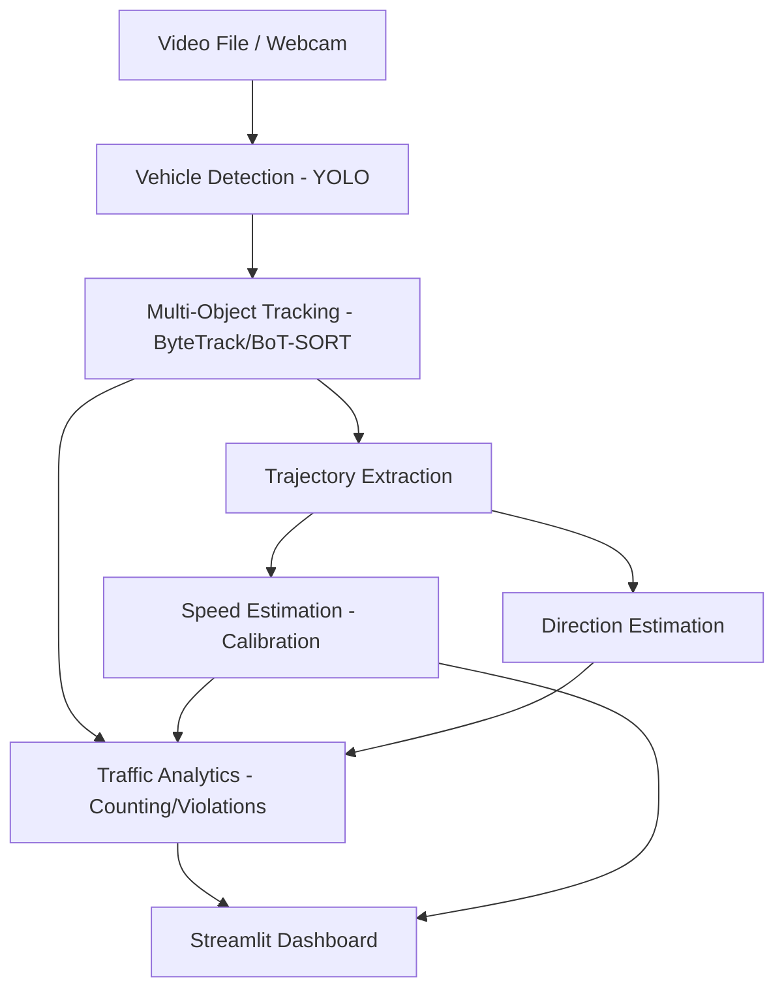

# AutoVision — Real-Time Vehicle Intelligence & Traffic Analytics

An intermediate-level computer vision system that detects, tracks, and
analyzes vehicles from video files or a live camera stream. It estimates
approximate speed, counts vehicles by type, flags speed-limit violations,
and presents everything in an interactive Streamlit dashboard.

> **Scope note:** this project is for traffic analytics and educational
> computer vision purposes. It does not perform facial recognition, does
> not identify private individuals, and does not take any automated
> law-enforcement action. See [Privacy and Responsible Use](#privacy-and-responsible-use).

## Description

AutoVision runs a YOLO object detector over each frame to find cars,
motorcycles, buses, and trucks, then uses a modern multi-object tracker
(ByteTrack, or BoT-SORT as an alternative) to give each vehicle a
persistent ID as it moves through the scene. From each vehicle's tracked
trajectory, AutoVision derives:

- an **approximate speed** (current, average, and maximum), using a
  configurable, user-calibrated pixel-to-meter scale;
- a **travel direction** (screen-relative or geographic, if configured);
- **counts** of vehicles crossing a configurable line, broken down by type;
- **speed-violation flags** against a configurable speed limit;
- a **trajectory trail** for each vehicle.

All of this is surfaced in a Streamlit dashboard: an annotated video feed,
live statistics, a per-vehicle table, and traffic analytics charts.

## Features

- Vehicle detection (car, motorcycle, bus, truck) with class, confidence,
  and a unique tracking ID per vehicle
- Multi-object tracking (ByteTrack / BoT-SORT) with persistent IDs
- Configurable, calibration-based speed estimation (current / average / max)
- Vehicle counting by type, with duplicate-count prevention via a
  configurable counting line
- Direction estimation (screen-relative or geographic labels)
- Per-vehicle statistics: type, confidence, speeds, direction, time in
  scene, trajectory, violation status
- Configurable speed-limit violation detection and a violations log
- Trajectory visualization with a configurable history length
- Streamlit dashboard: annotated video, live stats, vehicle table, and
  Plotly charts (by type, count over time, speed distribution, average
  speed over time, violations over time)
- Three input modes: video file upload, webcam (where available), and a
  documented sample/demo path
- YAML-based configuration — no hardcoded thresholds or paths
- CPU-compatible by default, with automatic CUDA use when available
- Unit tests for the pure-logic pieces (speed math, calibration,
  counting, direction, violations) that run without a GPU or model
  download

## Architecture

```
Video / Camera
      │
      ▼
Vehicle Detection (Ultralytics YOLO)
      │
      ▼
Multi-Object Tracking (ByteTrack / BoT-SORT)
      │
      ▼
Trajectory Extraction (per-track position history)
      │
      ▼
Speed Estimation (calibrated pixel→meter conversion)
      │
      ▼
Traffic Analytics (counting, violations, per-type stats)
      │
      ▼
Streamlit Dashboard (video overlay, tables, charts)
```



Code is organized by responsibility under `app/`: `detection/` (raw YOLO
inference), `tracking/` (detect+track pipeline and direction logic),
`speed/` (calibration and speed math), `analytics/` (counting/violations/
history), `visualization/` (OpenCV overlay drawing), `config/` (typed
settings loaded from YAML), and `models/` (shared dataclasses).

## Demo

Run the Streamlit app and use the sidebar to pick an input mode. The main
panel shows the annotated video feed (bounding boxes, IDs, class, speed,
direction, trajectories, and violation highlighting in red), live metric
cards, a sortable vehicle table, and analytics charts below.

**Screenshots:** not included in this repository yet. If you'd like to add
some, run the app locally, capture a few frames of the dashboard, and drop
them into `docs/screenshots/` with a short caption in this section — please
avoid screenshots containing real, identifiable license plates or people.

## Requirements

- Python 3.11+
- pip
- ~2 GB free disk space for dependencies (PyTorch + Ultralytics)
- A CUDA-capable GPU is optional; the system runs on CPU by default
  (see [Performance](#performance))

## Installation

```bash
git clone https://github.com/Mzaq1559/autovision-vehicle-intelligence.git
cd autovision-vehicle-intelligence

python -m venv .venv
source .venv/bin/activate      # macOS/Linux
# .venv\Scripts\activate       # Windows (cmd)
# .venv\Scripts\Activate.ps1   # Windows (PowerShell)

pip install -r requirements.txt
```

## Usage

Start the dashboard:

```bash
streamlit run app/streamlit_app.py
```

Then, in the browser tab that opens:

1. Adjust settings in the sidebar (detection confidence, IoU threshold,
   speed limit, counting-line position, calibration distance).
2. Choose an **input mode**:
   - **Video file** — upload an `.mp4`, `.avi`, `.mov`, or `.mkv` file.
   - **Webcam** — set a camera index and click "Start webcam". This
     requires a camera physically available to the machine running the
     Streamlit process; it will not work in most hosted/containerized
     deployments. If unavailable, upload a short clip instead (see the
     in-app message).
   - **Sample / demo** — no video is bundled with this repository (to
     avoid shipping copyrighted media). Download a short Creative-Commons
     or otherwise licensed traffic clip, place it under `assets/`, then
     use "Video file" to upload it. Search terms like "traffic intersection
     stock footage CC0" on sites such as Pexels or Pixabay turn up
     suitable clips.
3. Click "Stop processing" at any time to end the current run; the
   dashboard's charts populate from the run's history.

The first run downloads YOLO weights automatically (see
[Model Management](#model-management-1)).

## Speed Estimation Method

Speed is computed from **pixel displacement over time**, converted to
real-world units using a scale factor you supply (meters per pixel derived
from two reference points a known distance apart). This is a linear
approximation: it assumes the measurement region is roughly perpendicular
to the camera and close to the calibrated reference. **It is not a
substitute for radar/lidar or a fully perspective-corrected, surveyed
camera rig**, and speeds should be treated as approximate for analytics
and educational purposes. See [Calibration](#calibration) and
[docs/calibration.md](docs/calibration.md) for full detail, including how
to improve accuracy.

## Calibration

See [docs/calibration.md](docs/calibration.md) for the full guide. In
short: measure a known real-world distance between two points visible in
your scene, note their pixel coordinates, and enter both in
`configs/default.yaml` under `calibration:`.

## Configuration

All tunable parameters live in `configs/default.yaml` (copy it to make a
scene-specific config, e.g. `configs/my_intersection.yaml`, and point
`AUTOVISION_CONFIG` at it, or load it directly). Key sections:

| Section | Purpose |
|---|---|
| `model` | YOLO weights path, device (`auto`/`cpu`/`cuda`), confidence, IoU threshold, class filter |
| `tracker` | Tracker type (`bytetrack`/`botsort`), buffer size, match threshold, trajectory history length |
| `calibration` | Reference pixel points + real-world distance for speed conversion; optional FPS override |
| `measurement_zone` | Where the counting/measurement line sits (fraction of frame height) |
| `speed` | Speed limit, smoothing window, minimum samples before reporting a speed |
| `direction` | Screen-relative vs. geographic labels, minimum displacement to avoid "Stationary" noise |
| `counting` | Counting-line position and thickness |
| `video` | Default FPS fallback, max processing width |

Many of these (confidence, IoU, speed limit, counting line, calibration
distance) can also be adjusted live from the Streamlit sidebar for quick
iteration; edit the YAML for durable, per-scene defaults.

## Project Structure

```
autovision-vehicle-intelligence/
├── app/
│   ├── streamlit_app.py       # Dashboard entry point
│   ├── config/settings.py     # Typed config loaded from YAML
│   ├── detection/detector.py  # Standalone frame-level YOLO detection
│   ├── tracking/tracker.py    # Detect+track pipeline, direction estimation
│   ├── speed/
│   │   ├── calibration.py     # Pixel→meter scale factor
│   │   └── estimator.py       # Speed math + smoothing
│   ├── analytics/traffic.py   # Counting, violations, history/snapshots
│   ├── visualization/renderer.py  # OpenCV overlay drawing
│   ├── models/vehicle.py      # Detection / VehicleTrack dataclasses
│   └── utils/video.py         # Video/camera source handling
├── configs/default.yaml       # Example configuration
├── tests/                     # Unit tests (no GPU / model download required)
├── docs/calibration.md        # Calibration guide
├── assets/                    # Local sample media (gitignored; not shipped)
├── requirements.txt
├── pyproject.toml
└── LICENSE
```

## Testing

```bash
pip install -r requirements.txt   # or: pip install -e ".[dev]"
pytest
```

The test suite (`tests/test_speed.py`, `tests/test_tracking.py`,
`tests/test_analytics.py`) covers calibration math, speed calculation and
smoothing, direction estimation, vehicle-track state updates, line-crossing
and counting logic, and speed-violation detection. These are pure-Python
unit tests — they do not require a GPU, a webcam, or downloading YOLO
weights, and were run and passed in this project's build environment.

Detection/tracking modules that depend on `ultralytics`/OpenCV are
structured to be testable in principle but are not exercised by the
default test suite, since that would require downloading model weights;
they can be covered by separate integration tests if desired.

## Performance

- **CPU:** works out of the box; expect roughly a few frames per second
  on a modern multi-core CPU with the default `yolov8n.pt` (nano) model,
  depending on resolution and hardware. This is adequate for analytics on
  recorded video but may lag behind real-time on a live stream.
- **GPU (CUDA):** if a CUDA-capable GPU and matching PyTorch build are
  available, `model.device: auto` selects it automatically, typically
  giving real-time or near-real-time throughput.
- Lowering `video.max_width` or choosing a smaller/faster model reduces
  load at the cost of detection quality.

## Limitations

- Speed estimation is an approximation dependent on manual camera/scene
  calibration (see [Speed Estimation Method](#speed-estimation-method)).
- Accuracy degrades with camera perspective distortion, especially far
  from the calibrated reference region.
- Heavy occlusion (vehicles overlapping or hidden behind others) can
  cause missed detections or track loss.
- Poor lighting, glare, rain, or motion blur reduce detection quality.
- Dense/heavy traffic increases the chance of ID switches during tracking.
- Camera movement (pan/tilt/zoom, vibration) invalidates the calibration
  and will produce unreliable speeds and directions.
- Direction labels are derived from simple net-displacement geometry, not
  true compass bearings, unless you manually map screen directions to
  geographic ones in the config.
- This is an educational/analytics tool, not a certified or
  enforcement-grade measurement system.

## Privacy and Responsible Use

AutoVision is designed for vehicle and traffic analytics. It does **not**
perform facial recognition, does **not** attempt to identify individual
people, and does **not** take automated enforcement actions (e.g. issuing
citations). License-plate reading is explicitly out of scope for this
build (see Future Improvements). If you deploy this system, be mindful of
local laws and regulations regarding video surveillance and traffic
monitoring, and avoid capturing or retaining identifiable footage of
people beyond what your use case and applicable law permit.

## Future Improvements

- Full perspective/homography-based calibration instead of a single
  linear scale factor
- Optional license-plate detection as a separate, clearly-labeled research
  module
- Automatic vehicle re-identification across camera gaps
- Traffic density / congestion estimation
- Lane-level detection and per-lane analytics
- Cloud/edge deployment guide
- GPU inference optimization (TensorRT/ONNX export)

## Model Management

The default model is `yolov8n.pt` (Ultralytics YOLOv8 "nano"), chosen for
its balance of speed and accuracy on CPU-class hardware for an
intermediate project. It is **not** committed to this repository — the
`ultralytics` package downloads it automatically on first use and caches
it locally. To use a different model (e.g. a larger YOLOv8 variant, or a
custom-trained model), change `model.weights` in your config to another
Ultralytics model name or a local `.pt` file path.

## License

MIT — see [LICENSE](LICENSE).
